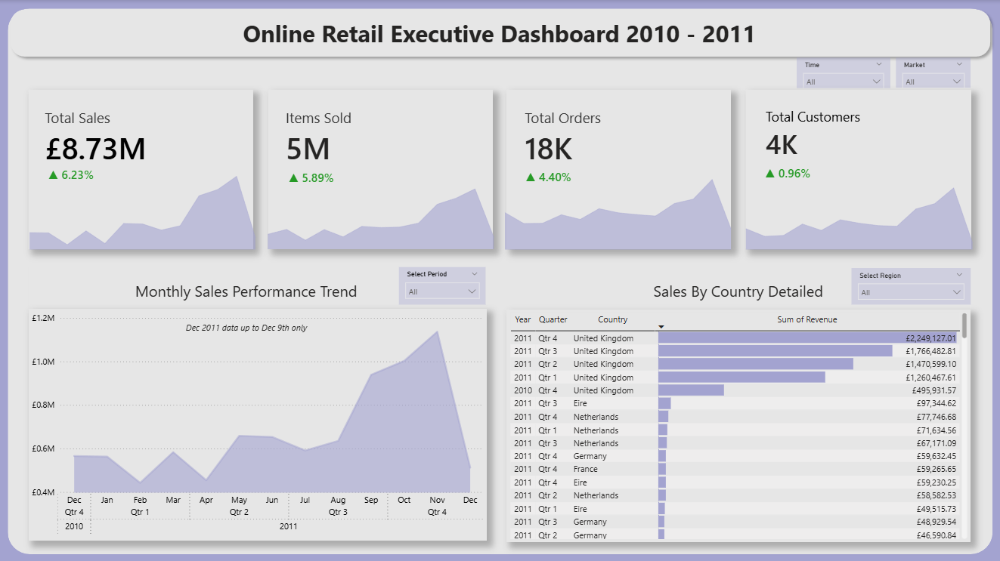

# Online Retail Executive Dashboard (2010 - 2011)

## Project Overview

This project delivers an end-to-end data pipeline and analysis workflow, transforming a raw, chaotic global retail dataset into an enterprise-grade interactive dashboard. The project spans across the complete data analysis lifecycle: **Data Inspection** (Excel), **Data Cleaning & Transformation** (SQL), **Exploratory Data Analysis** (Python), and **Data Modeling & Visualization** (Power BI).

---

## Objectives

- **Monitor Executive KPIs:** Track real-time Revenue, Items Sold, Total Orders, and Unique Customer growth.
- **Identify Seasonality & Trends:** Analyze Monthly Sales Performance to identify peak periods and operational cut-offs.
- **Geographical Market Analysis:** Breakdown sales distributions to pinpoint core domestic and high-potential international markets.
- **Interactive Decision-Making:** Deliver dynamic slicing capabilities by Time (Year, Quarter, Month) and Market.

---

## Tools & Technologies

| Phase | Tools | Key Functions |
| :--- | :--- | :--- |
| **Inspection** | Microsoft Excel | Initial data profiling, anomaly detection, and schema assessment. |
| **Data Cleaning** | Google BigQuery (SQL) | Handling nulls, filtering cancelled orders, and record deduplication. |
| **EDA** | Python (Pandas, Seaborn, Matplotlib) | Statistical distribution profiling and outlier analysis. |
| **Data Modeling** | Power BI (DAX) | Star Schema development, dynamic Calendar Table, and MoM Growth Metrics. |

---

## Project Workflow

1. **Data Inspection (Excel):** Evaluated raw data structures, identified critical system anomalies, and mapped out data transformation requirements.
2. **Data Cleaning (SQL):** Executed advanced queries to filter out cancelled/test transactions and standardized field formats.
3. **Exploratory Data Analysis (Python):** Investigated data distribution, sales correlations, and prepared the final staging dataset.
4. **Data Modeling & Visualization (Power BI):** Formulated a robust Star Schema model, connecting the transaction fact table to a customized dimension Calendar table (1:* relationship) to power complex Time Intelligence metrics.

---

## Data Cleaning & SQL Implementation

The dataset cleaning process included:
- Removing cancelled transactions
- Removing transactions with zero or negative values
- Handling missing values
- Removing duplicate records
- Standardizing data types
- Creating a clean final dataset for analysis

---

<details>
<summary>📂 Click to expand SQL Query</summary>
    
### Sample Cleaning Query in Google BigQuery
```sql
CREATE OR REPLACE TABLE `cleaning-data-online-retail.online_retail_cleaning.online_retail_cleaned` AS
SELECT *
FROM `cleaning-data-online-retail.online_retail_cleaning.online_retail_raw`
WHERE
    -- 1. InvoiceNo: not a canceled transaction & not empty
    NOT STARTS_WITH(InvoiceNo, 'C')
    AND NULLIF(InvoiceNo, '') IS NOT NULL
    
    -- 2. StockCode: valid product format only (5 digits + optional letters)
    AND REGEXP_CONTAINS(StockCode, r'^[0-9]{5}[A-Z]*$')
    
    -- 3. Description: not blank & not text anomaly
    AND NULLIF(Description, '') IS NOT NULL
    AND NOT REGEXP_CONTAINS(Description, r'^\d+$')
    AND NOT REGEXP_CONTAINS(Description, r'^\?+$|MISSING|LOST|DAMAG')
    
    -- 4. Quantity: only valid transactions
    AND Quantity > 0
    
    -- 5. InvoiceDate: cannot be NULL
    AND InvoiceDate IS NOT NULL
    
    -- 6. UnitPrice: must be greater than 0
    AND UnitPrice > 0
    
    -- 7. CustomerID: not blank
    AND NULLIF(CustomerID, '') IS NOT NULL
    
    -- 8. Country: not unspecified
    AND Country != 'Unspecified'
```
</details>

<details>
<summary>📂 Click to expand DAX Query</summary>

## DAX & Data Modeling Features

To build an "anti-error" dashboard capable of dynamic filtering across any timeframe or market without breaking the UI, advanced Time Intelligence DAX Measures were engineered:
-- Example of Month-over-Month (MoM) Customer Growth Logic:
```dax
Total Customers = DISTINCTCOUNT('online_retail_final'[CustomerID])

Previous Customers = 
CALCULATE(
    [Total Customers],
    DATEADD(
        Calendar[Date],
        -1,
        MONTH
    )
)

Customers Growth % = 
DIVIDE(
    [Total Customers] - [Previous Customers],
    [Previous Customers],
    0
)
```
</details>

---

## Dashboard Features

- KPI Cards (Revenue, Quantity, Orders, Customers)
- Monthly Sales Trend Analysis
- Sales by Country Visualization
- Interactive Slicers (Year, Quarter, Month, Country)
- Month-over-Month (MoM) Growth Indicators

---

## Dashboard Preview


---

## Key Business Insights

- Market Revenue Concentration: The United Kingdom stands as the absolute core domestic market, contributing over £6.7M to the global revenue. Eire (Ireland) and the Netherlands follow closely as the top two highest-potential international markets, making them primary targets for localized expansion.
- Q4 Sales Surge (Seasonality): Monthly sales maintained a steady baseline of £0.5M - £0.6M for the majority of the year, before experiencing a massive Q4 escalation in October and November, peaking at ~£1.1M. Supply chain, inventory management, and logistics must be heavily optimized ahead of Q4 cycles in subsequent years.
- Customer & Order Stability: Total Customers (4K) and Total Orders (18K) moved in perfect synchronization with monthly transaction spikes. This indicates a highly reliable and repeating customer base, reflecting healthy retention rates and a sustained positive MoM customer growth of 0.96% overall.
- December Data Cut-Off Notice: The abrupt downward slope at the very end of the monthly trend chart is not an organic decline in sales performance. It represents a strict technical data cut-off, as the database only contains records up until December 9, 2011.

---

## Conclusion

This end-to-end project demonstrates the successful conversion of raw, transactional data into an optimized, production-ready enterprise dashboard. By resolving data quality issues in SQL/Python and building a proper data model in Power BI, the final artifact serves as a reliable, single source of truth for executive business monitoring and strategic forecasting.

---

## Author
Robby Adriansyah Fadillah
